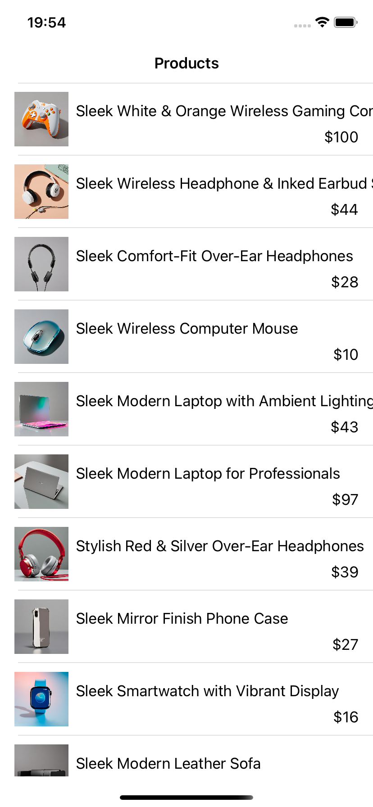
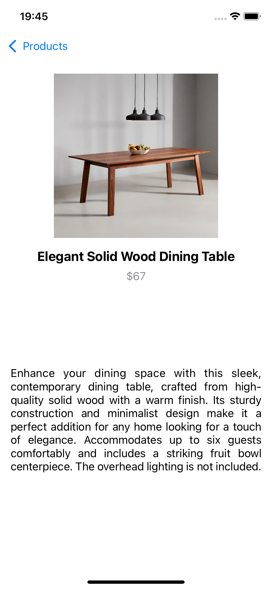

# ShopClosureBindingApp

ShopClosureBindingApp is a sample iOS project built with **Swift** and **UIKit**, following the **MVVM (Model-View-ViewModel)** architecture.  
The app consumes a **REST API** to fetch and display product data, featuring both a **product list screen** and a **product detail screen**.  

  
  

## Features
- **MVVM Architecture** for clean separation of concerns  
- **URLSession** for networking with REST API  
- **Closure-based callbacks** for data binding between ViewModels and Views  
- **UITableView with custom cells** to display product images, titles, and prices  
- **Detail screen** to show product description and larger images  

## Tech Stack
- Swift  
- UIKit  
- MVVM  
- URLSession  
- REST API Integration  

---
